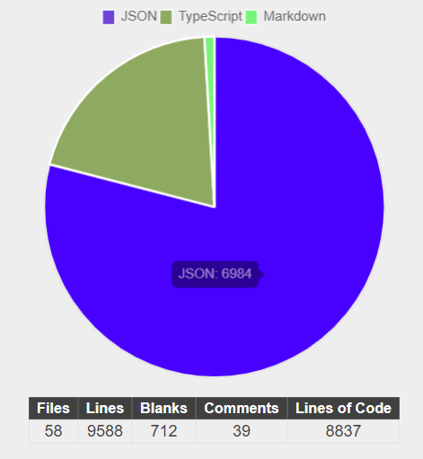

# Gama Bank 🏦💲

## Descrição

Projeto final para o treinamento da turma 6 de NodeJS da Gama Academy, oferecido pela Accenture. 

## Objetivo

Construir uma aplicação web, utilizando Node.js e todas as bibliotecas e tecnologias que aprendemos durante o curso (você é livre para substitui-lás mas fica por sua conta e risco, ok ?) e disponibiliza-las em um servidor em cloud com acesso irrestrito por zona ou por horario.  

# Time 2 - Perseverance :muscle:

## Membros :pushpin:

- [Alexsander Penavilla](https://github.com/AlexPenavilla) 
- [Nivaldo Júnior](https://github.com/Juniornbs) 
- [Rafael Sampaio](https://github.com/sampaiorafael)
- [Stênio Amorim](https://github.com/stamorim28)
- [Wallace Rooger](https://github.com/WallaceRooger) 
- [Yahnnis Monteiro](https://github.com/yahnnThomas)

## Rotas Disponíveis

- GET `/status` - Verificar status do servidor  
    Requisitos: N/A  
    Autenticação: N/A  

- POST `/signup` - Criar usuários  
    Requisitos: username, password, email, cpf, name, adress, phone  
    Autenticação: N/A  

- POST `/auth` - Login  
    Requisitos: reqUsername, reqPassword  
    Autenticação: N/A 

- GET `/accounts/checkbalance` - Verificar saldo  
    Requisitos: N/A  
    Autenticação: JWT  

- POST `/accounts/selfdeposit` -  Deposito na própria conta  
    Requisitos: value   
    Autenticação: JWT  

- POST `/accounts/externdeposit` - Deposito externo identificado  
    Requisitos: name, cpf, accountNumber, value   
    Autenticação: N/A 

- POST `/account/interntransfer` -  Transferências Internas  
    Requisitos: toUsername, value  
    Autenticação: JWT  

- POST `/account/externtransfer` - Transferências Externas  
    Requisitos: bankCode, cpf, value  
    Autenticação: JWT  

- GET `/account/movementrecords` - Extrato conta corrente do mês    
    Requisitos: N/A  
    Parametros opcionais: operation (valores: 'remove' ou 'deposit')  
    Autenticação: JWT  

- POST `/account/purchasedebt` - Compra no débito  
    Requisitos: value  
    Autenticação: JWT  

- POST `/creditcard/purchase` - Compra no crédito    
    Requisitos: value, description, instalments    
    Autenticação: JWT  

- GET `/creditcard/checkinvoice` - Verificar fatura    
    Requisitos: N/A     
    Autenticação: JWT  

- GET `creditcard/paydueinvoice` - Pagar fatura cartão de crédito   
    Requisitos: N/A     
    Autenticação: JWT  

- GET `/swagger` - Swagger  
    Requisitos: N/A  
    Autenticação: N/A  

> **Observação** toda verificação será feita via JWT (jsonwebtoken) enviada no Header do HttpRequest, através da chave `Authorization`

## Scripts de inicialização

- `npm run start` Iniciar o servidor
- `npm run start_dev` Inicia o servidor em watch mode
- `npm run compile` Compilar o TypeScript
- `npm run compile_dev` Compilar o TypeScript em watch mode
- `npm run test` Inicia o teste unitário
- `npm run test_dev` Inicia o teste unitário em watch mode

> **Observação**: Para iniciar em produção, recomenda-se somente a utilização do script `npm run start` apos ter o TypeScript compilado pelo `npm run compile`. Todos scripts com o sufixo _dev foram criados para aumentar a produtividade em modo de desenvolvimento e por isso recomenda-se o seu uso somente durante esse processo

## Features do Sistema  

### Cadastro  
- Criação de conta de usuário  
- Criação do cliente do banco  
- Criação de conta corrente  
- Criação de cartão de crédito  
- Publicação do balanço inicial de conta corrente e fatura do cartão de crédio  

### Conta Corrente
- Compra com débito, utilizando saldo da conta corrente   
- Extrato de movimentação da conta corrente(opcionalmente parametrizado)  
- Verificação do saldo atual da conta corrente  
- Auto deposito  
- Deposito de pessoa externa identificada  
### Transferências 

- Transferências internas entre contas
- Transferências externas para outros bancos indentificados
### Cartão de Crédito
- Compra no Cartão de crédito  
- Verificação fatura atual do cartão de crédito e lista de compras   
- Pagamento da fatura do cartão de crédito  
### Documentação
- Documentação das rotas pelo swagger  
  
## Curiosidades do sistema :octocat:

### Tamanho do sistema  

### Tecnologias principais :pushpin:  

- Typescript  
- Express  
- TypeORM  
- MySQL  
- Bcrypt  
- Jsonwebtoken  
- Mocha  
- Chai  

### Arquitetura do Sistema :computer:  

- Camada de controllers  
- Camada de serviços  
- Camada de modelos  
- Camada de repositório com TypeORM  
- Modularizado em responsabilidades únicas  
- Variaveis de ambiente com informações sensíveis 

### Metodologia de trabalho :bookmark_tabs:

- Kanban  
- Git flow  
- Commits atômicos  
- Código limpo  

> Mais informações sobre o sistema como as Entidades de Relacionamento do banco de dados etc... Pode ser encontrada dentro da pasta docs

#### Agradecimentos  
Toda a equipe do Time 2, agradece imensamente ao treinamento oferecido pela Accenture através da Gama Academy, em especial as pessoas que nos deram toda assistência para o nosso particular desenvolvimento pessoal e intelectual: Bruce, Deah e JC o homem, a lenda, o melhor professor. Obrigado a todos!!!

